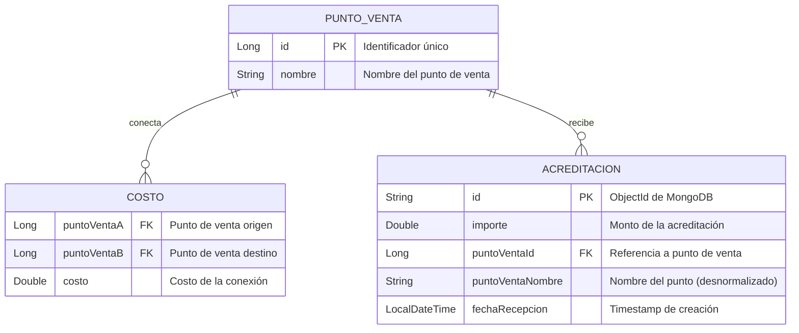

# challenge-java-2025-ApiRest
Challenge Java 2025 - API REST para gestión de puntos de venta, rutas y acreditaciones





punto de venta puede tener muchas conexiones (costos) con otros puntos
punto de venta puede recibir muchas acreditaciones

PUNTO_VENTA ↔ COSTO (Muchos a Muchos)
PUNTO_VENTA → ACREDITACION (Uno a Muchos)

```mermaid
classDiagram

    %% Entidades de Dominio
    class PuntoVenta {
        -Long id
        -String nombre
        +PuntoVenta(Long id, String nombre)
        +getId() Long
        +getNombre() String
        +setNombre(String nombre)
    }

    class Acreditacion {
        -String id
        -Double importe
        -Long puntoVentaId
        -String puntoVentaNombre
        -LocalDateTime fechaRecepcion
        +Acreditacion()
    }

    %% DTOs

    record PuntoVentaRequest {
        -String nombre
    }

    record CostoRequest {
        -Long puntoVentaA
        -Long puntoVentaB
        -Double costo
    }

    record AcreditacionRequest {
        -Double importe
        -Long puntoVentaId
    }

    record CaminoMinimoResponse {
        -Double costoTotal
        -List~String~ camino
    }

    record ConexionResponse {
        -Long puntoVentaId
        -String nombre
        -Double costo
    }

    %% Servicios
    class PuntoVentaService {
        -ConcurrentHashMap~Long, PuntoVenta~ cachePuntosVenta
        +inicializarCache() void
        +obtenerTodos() List~PuntoVenta~
        +obtenerPorId(Long id) PuntoVenta
        +crear(String nombre) PuntoVenta
        +actualizar(Long id, String nombre) PuntoVenta
        +eliminar(Long id) void
    }

    class CostoService {
        -ConcurrentHashMap~Long, Map~Long, Double~~ grafo
        -PuntoVentaService puntoVentaServiceImpl
        +inicializarGrafo() void
        +agregarCosto(Long a, Long b, Double costo) void
        +removerCosto(Long a, Long b) void
        +obtenerConexiones(Long id) List~ConexionResponse~
        +calcularCaminoMinimo(Long origen, Long destino) CaminoMinimoResponse
        -dijkstra(Long origen, Long destino) Map
        -reconstruirCamino(Map, Long, Long) List
    }

    class AcreditacionService {
        -AcreditacionRepository repository
        -PuntoVentaService puntoVentaServiceImpl
        +procesar(AcreditacionRequest request) Acreditacion
        +obtenerTodas() List~Acreditacion~
    }

    %% Repositorio
    class AcreditacionRepository {
        <<interface>>
        +save(Acreditacion) Acreditacion
        +findAll() List~Acreditacion~
    }

    %% Controladores REST
    class PuntoVentaController {
        -PuntoVentaService service
        +GET obtenerTodos()
        +POST crear(PuntoVentaRequest)
        +PUT actualizar(Long, PuntoVentaRequest)
        +DELETE eliminar(Long)
    }

    class CostoController {
        -CostoService service
        +POST agregarCosto(CostoRequest)
        +DELETE removerCosto(Long a, Long b)
        +GET obtenerConexiones(Long)
        +GET calcularCaminoMinimo(Long origen, Long destino)
    }

    class AcreditacionController {
        -AcreditacionService service
        +POST crear(AcreditacionRequest)
        +GET obtenerTodas()
    }
```


%% Relaciones
    PuntoVentaController --> PuntoVentaService
    CostoController --> CostoService
    AcreditacionController --> AcreditacionService
    
    CostoService --> PuntoVentaService
    AcreditacionService --> PuntoVentaService
    AcreditacionService --> AcreditacionRepository
    
    AcreditacionRepository --> Acreditacion
    PuntoVentaService --> PuntoVenta
    
    PuntoVentaController ..> PuntoVentaRequest
    CostoController ..> CostoRequest
    CostoController ..> CaminoMinimoResponse
    CostoController ..> ConexionResponse
    AcreditacionController ..> AcreditacionRequest
    AcreditacionService --> Acreditacion